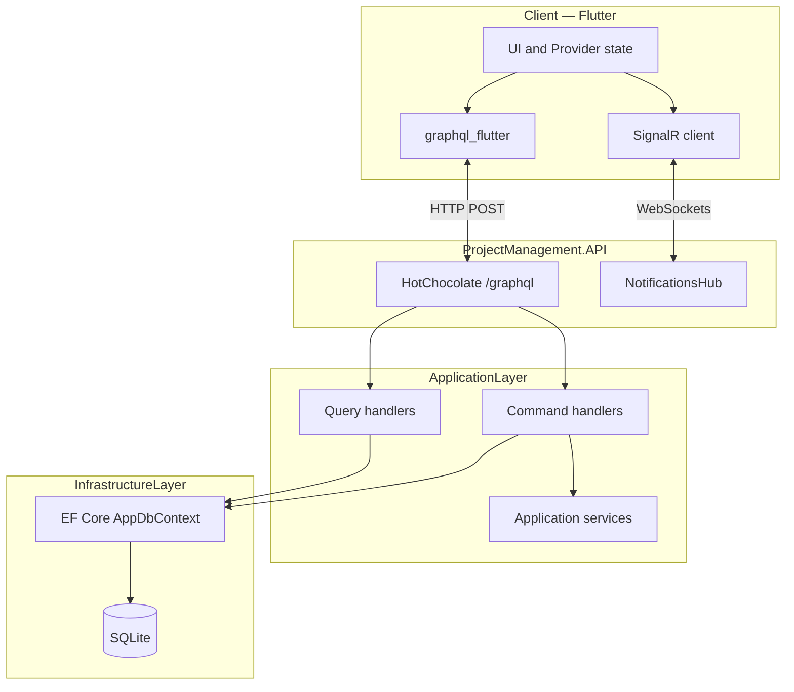

# Project overview — PEDWM (TP1)

This document is a **detailed, revised** description of the whole repository: purpose, architecture, domain model, technologies, and how the Flutter client and .NET backend fit together. It consolidates the academic brief ([`Proposta.Tex`](Proposta.Tex)), the logical diagrams ([`Arquitetura.mermaid`](Arquitetura.mermaid), [`ModeloEntidades.mermaid`](ModeloEntidades.mermaid)), and the **current** code layout.

---

## 1. Context and purpose

**Course:** Paradigmas Emergentes para o Desenvolvimento Web e Mobile (PEDWM) — Trabalho Prático 1, 2025/2026.

**Institution:** Escola Superior de Tecnologia e Gestão (ESTG), Instituto Politécnico do Porto (IPP), Felgueiras, Portugal.

**Authors:** Dany Raimundo (8250047), João Mendes (8250051), Magson Chostak (8250657).

**Product (working title in the app):** *Time Planner* — a **collaborative system** for managing **teams**, **projects**, **tasks**, and **logged hours**, with **real-time notifications** delivered over WebSockets.

The work satisfies the TP1 cross-cutting requirements: **GraphQL**, **WebSockets**, **two or more design patterns**, **separate front-end and back-end**, and supporting **documentation** (architecture, UML-oriented material, pattern justification, technology inventory, and story-point tracking — see the LaTeX report for the formal submission narrative).

---

## 2. High-level architecture

The solution follows **Clean Architecture–style layering**: dependencies point **inward** toward the domain; outer layers implement interfaces and infrastructure.

| Layer | .NET projects / location | Role |
|--------|-------------------------|------|
| **Domain** | `backend/DomainLayer` | Entities, value-oriented rules, fluent **builders** (e.g. task/project construction), notifications model. |
| **Application** | `backend/ApplicationLayer` | Commands, query handlers, application services, repository abstractions, **TaskFactory**, **CompositeNotificationDeliveryStrategy**. |
| **Infrastructure** | `backend/InfrastructureLayer` | **EF Core** (`AppDbContext`), concrete repositories, **EmailDeliveryStrategy**, **LoggerService** (singleton). |
| **Presentation** | `backend/ProjectManagement.API` (project file: `PresentationLayer.csproj`) | **HotChocolate** GraphQL (`Query`, `Mutation`), **SignalR** `NotificationsHub`, **SignalRNotificationDeliveryStrategy**, DI wiring, DTOs. |

**Client:** Flutter/Dart app at repository root (`lib/`), using **graphql_flutter** for HTTP GraphQL and **signalr_netcore** for the SignalR connection.

**Persistence:** **SQLite** via Entity Framework Core. Polymorphic aggregates use **TPH** (single table per hierarchy) for `ProjectBase` and `TaskBase`.

### 2.1 Logical data and real-time flow

- **GraphQL:** typed queries and mutations over HTTP (default HotChocolate endpoint).
- **Real time:** SignalR hub mapped at `/hubs/notifications` (see `Program.cs`); clients join user-scoped groups for targeted pushes.

---

## 3. Repository layout (what lives where)

| Path | Contents |
|------|----------|
| `lib/` | Flutter UI (`screens/`, `widgets/`), **Provider** state (`providers/`), GraphQL client setup (`data/graphql/`), repositories that call the API. |
| `env/dev.json` | Environment-style configuration (referenced from `pubspec.yaml` assets). |
| `backend/DomainLayer/` | Domain entities and builders (e.g. `FeatureTask`, `BugTask`, project hierarchy). |
| `backend/ApplicationLayer/` | CQRS-style handlers, commands, services, factories, composite notification strategy. |
| `backend/InfrastructureLayer/` | EF mappings, migrations context, repositories, email strategy, logging singleton. |
| `backend/ProjectManagement.API/` | GraphQL schema types, mutations/queries, hub, DI extensions, DTOs. |
| `backend/*Tests/` | xUnit (and Moq where used) for domain, application, infrastructure, and presentation layers. |
| `Docs/` | LaTeX report, Mermaid diagrams, draw.io UML, image placeholders — see [`Docs/README.md`](README.md). |

---

## 4. Domain model (conceptual)

The conceptual ER view (aligned with `AppDbContext`) is maintained in [`ModeloEntidades.mermaid`](ModeloEntidades.mermaid). Summary:

### 4.1 Users and teams

- **User:** identity, profile fields, optional **Team** membership, **Role**.
- **Team:** groups users; **projects** can be associated to a team.

### 4.2 Projects (`ProjectBase`, TPH)

All project-like records share one table with a **discriminator** (`ProjectType`). Types described in the report include standard **Project** (e.g. budget hours, manager, client, status) and non-billable or calendar-style entries such as **SickLeave**, **Holiday**, and **Training** — enabling unified time/accounting views where the model requires it.

### 4.3 Tasks (`TaskBase`, TPH)

- **FeatureTask:** agile-style work, **story points**.
- **BugTask:** **severity** and **environment** (and shared title/status/project link).

### 4.4 Hours and notifications

- **HourLog:** hours per **user**, **project**, optional **task**, timestamp.
- **Notification:** persisted notification records; delivery to the client is complemented by **SignalR** (and a logged **email** path via strategy).

---

## 5. Functional capabilities (product view)

- **Projects:** list, filter by context (e.g. by user), create, detail views; integration with **budget hours** where applicable.
- **Tasks:** create polymorphic tasks (**feature** vs **bug**), list and query by project/user/id as exposed in GraphQL.
- **Hours:** add/report hours to projects (timesheet-style usage), consistent with domain rules in handlers/services.
- **Users and teams:** management and listings consumed by the Flutter providers (`UsersProvider`, `TeamsProvider`, etc.).
- **Notifications:** server pushes over SignalR; `NotificationsProvider` on the client maintains the parallel real-time channel alongside GraphQL.

---

## 6. Design patterns (as implemented)

These are the patterns called out in [`Proposta.Tex`](Proposta.Tex) and reflected in code:

1. **CQRS (lightweight)** — Separate **command** handlers (writes, domain changes) and **query** handlers (reads, DTO-shaped responses). GraphQL resolvers inject the appropriate handler/service.
2. **Builder (+ CRTP)** — Fluent builders for domain aggregates (e.g. `TaskBaseBuilder` hierarchy, project builders) centralize validation and construction steps.
3. **Factory** — `TaskFactory` builds the correct `TaskBase` subtype from `CreateTaskCommand`, keeping the API layer free of large `switch` blocks.
4. **Strategy** — `INotificationDeliveryStrategy` with **email** (`InfrastructureLayer/Patterns/Strategy/EmailDeliveryStrategy`) and **SignalR** (`SignalRNotificationDeliveryStrategy` in the API project).
5. **Composite** — `CompositeNotificationDeliveryStrategy` runs all registered strategies (e.g. email + SignalR) for a single notification event.
6. **Singleton** — `LoggerService` exposes a single shared instance for structured logging used across repositories and strategies.

---

## 7. API surface

### 7.1 GraphQL (HotChocolate)

- **Query:** read operations — projects, tasks, users, teams, and related lookups (see `ProjectManagement.API/GraphQL/Query.cs`). Errors for missing entities are surfaced as `GraphQLException` where appropriate.
- **Mutation:** write operations — create project/task/user/team, hour logging, assignments, etc. (see `Mutation.cs`). Input **DTOs** map to application **commands** (Mapster configuration in `InfrastructureLayer/Mapping/MapsterConfiguration.cs` and related extensions).

### 7.2 SignalR

- **Hub:** `NotificationsHub` under `ProjectManagement.API/Hubs/`.
- **Endpoint:** `/hubs/notifications`.
- **Delivery:** `SignalRNotificationDeliveryStrategy` uses `IHubContext<NotificationsHub>` to send messages to connection groups (e.g. per-user groups per the report’s `user-{id}` convention).

---

## 8. Flutter client stack

The mobile/desktop/web client lives at the **repository root** (`pubspec.yaml`, `lib/`). The app id in code is **Time Planner** (`TimePlannerApp` in `lib/main.dart`). It is structured as a **single Flutter module**: UI screens and widgets, **Provider**-based state, a thin **data layer** (GraphQL + repositories), and a **parallel SignalR** connection for push-style notifications.

### 8.1 Application entry and widget tree

`main.dart`:

1. Ensures bindings and initializes **locale date formatting** (`intl`, `initializeDateFormatting('en_US', …)`).
2. Builds one shared **`GraphQLClient`** via `createGraphQLClient()` (`lib/data/graphql/graphql_client_factory.dart`) and wraps the app in **`GraphQLProvider`** with a `ValueNotifier<GraphQLClient>` so the client could be swapped later without restarting.
3. Registers a **`Provider<GraphQLClient>`** for direct injection into repositories/providers that need the client.
4. **`MultiProvider`** registers `ChangeNotifier` providers: `AuthProvider`, `UsersProvider`, `TeamsProvider`, `ProjectProvider` (each receives the GraphQL client where needed), and `NotificationsProvider` (SignalR only).
5. Optionally runs **`debugPingGraphql`** against the `bemVindo` query to verify connectivity during development.

The root widget is **`AuthSessionShell`**, which gates the UI on session state (see §8.5).

### 8.2 Configuration (API base URL and hub URL)

`lib/data/graphql/graphql_config.dart` reads backend endpoints from **Dart compile-time environment** variables:

| Variable | Purpose |
|----------|---------|
| `GRAPHQL_URL` | HTTP endpoint for Hot Chocolate (e.g. `http://localhost:5287/graphql`). |
| `NOTIFICATIONS_HUB_URL` | SignalR hub URL (e.g. `http://localhost:5287/hubs/notifications`). |

Pass them when running or building, for example:

`flutter run --dart-define=GRAPHQL_URL=http://localhost:5287/graphql --dart-define=NOTIFICATIONS_HUB_URL=http://localhost:5287/hubs/notifications`

The file `env/dev.json` in the repo lists the **same values** as a convenience reference for local development; it is declared as a Flutter **asset** in `pubspec.yaml` but the GraphQL config class does not load it at runtime—**`--dart-define` is what the current code uses**.

### 8.3 State management (`provider`)

| Provider | File | Responsibility |
|----------|------|----------------|
| **AuthProvider** | `lib/providers/auth_provider.dart` | Session lifecycle: loading flag, `fetchCurrentUser`, sign-out, role flags (`isAdmin`, `isProjectManager`), and fine-grained permissions (`canCreateUsers`, `canManageProjectsAndTasks`, etc.). |
| **UsersProvider** | `lib/providers/users_provider.dart` | User list and admin flows backed by GraphQL. |
| **TeamsProvider** | `lib/providers/teams_provider.dart` | Teams and membership operations via GraphQL. |
| **ProjectProvider** | `lib/providers/project_provider.dart` | Projects, tasks (via `task_repository`), hour logs, monthly aggregates, and related loading/error state. |
| **NotificationsProvider** | `lib/providers/notifications_provider.dart` | SignalR connection, recent notifications (capped), and a broadcast **stream** of `PushNotification` for UI listeners. |

`AuthProvider` currently resolves the signed-in user through **`fetchCurrentUserFromBackend`** in `users_repository.dart`, which is still a **stub** (fixed demo user id/name/email/role) with a TODO for a real backend session. The chosen **user id is aligned with the backend seed** so `JoinUserNotifications` targets the same SignalR group the server uses (`user-{id}`).

### 8.4 Data layer: GraphQL client, documents, and repositories

- **Client:** `createGraphQLClient()` uses **`HttpLink`** pointing at `GraphqlConfig.graphqlUrl` and an in-memory **`GraphQLCache`**. There is **no custom `AuthLink`** in the factory yet—authentication headers are not attached at the HTTP layer in the current snippet.
- **Documents:** `lib/data/graphql/graphql_operations.dart` centralizes **queries and mutations** as `gql` strings, aligned with the Hot Chocolate schema (**camelCase** field names), e.g. `ProjectsAndTasks`, `GetUsers`, `HourLogs(from, to)`, `CreateProject`, `CreateTask`, `CreateUser`, `CreateTeam`, `AssignTaskToUser`, `AssignUserToTeam`, `AddHoursToProject`, `ChangeProjectStatus`, etc.
- **Parsing and errors:** `graphql_result.dart` helpers assert GraphQL errors; **`backend_maps.dart`** maps enum-like strings from the API to Dart enums (e.g. user roles) and builds mutation variable payloads consistently.
- **Repositories** (under `lib/data/repositories/`) encapsulate **`client.query` / `client.mutate`** calls and return domain **`models/`** instances: `project_repository`, `task_repository`, `team_repository`, `users_repository`. This keeps widgets/providers free of raw GraphQL strings and variable maps.

### 8.5 Real-time notifications (SignalR)

- **`NotificationsProvider`** (`signalr_netcore`): builds a **`HubConnection`** with **automatic reconnect** backoff, listens for the server method/event **`notification`**, parses the first argument as JSON into **`PushNotification`**, prepends to **`recent`** (max 50), and emits on **`events`**. **`connectForUser(userId)`** starts the hub and invokes **`JoinUserNotifications`** with the user id so the server can add the connection to the correct group.
- **`NotificationSessionShell`** wraps the main app **after** login: on first frame it calls **`connectForUser(auth.user.id)`**; on **dispose** it **disconnects** (e.g. on sign-out when the subtree is removed). This keeps WebSocket lifetime tied to an authenticated session.
- **`MainNavigationScreen`** subscribes to **`provider.events`** and shows a **`SnackBar`** for each incoming `PushNotification`, giving immediate in-app feedback alongside the provider’s stored history.

### 8.6 UI structure: navigation, screens, and widgets

- **Session gate:** `AuthSessionShell` → if session loading, **`SessionLoadingView`**; if not authenticated, **`LoginView`**; else **`NotificationSessionShell`** → **`MainNavigationScreen`**.
- **Primary navigation:** `MainNavigationScreen` uses a **`NavigationBar`** with three tabs: **Dashboard** (`DashboardView`), **Projects** (`ProjectListView`), **Hours** (`MonthlyHoursView`).
- **Feature screens** (under `lib/screens/`): project list/detail/create, create task, create user/team, team members, admin panel, monthly hours, login/session loading, etc. **`DashboardView`** composes stats/widgets such as **`dashboard_stat_card.dart`**; project flows use tiles and bottom sheets (**`project_task_tile.dart`**, **`task_detail_bottom_sheet.dart`**, **`month_tasks_dialog.dart`**).
- **Theming:** `lib/theme/app_colors.dart` drives a **dark Material 3** look (`ThemeData.dark` + `ColorScheme` in `main.dart`).

### 8.7 Domain models (`lib/models/`)

Lightweight immutable-style data for the UI: e.g. **`AppUser`**, **`UserRole`**, **`ProjectModel`**, **`TaskModel`**, **`TeamModel`**, **`HoursLogEntry`**, **`PushNotification`**, plus stats helpers such as **`dashboard_stats.dart`**. They are populated from GraphQL JSON via repositories and maps—not ORM entities.

### 8.8 Dependencies (from `pubspec.yaml`)

| Package | Role |
|---------|------|
| `provider` | `ChangeNotifier` + `Provider` / `Consumer` / `context.read`. |
| `graphql` / `graphql_flutter` | Client, `GraphQLProvider`, `QueryOptions` / `MutationOptions`. |
| `signalr_netcore` | SignalR client for `NotificationsHub`. |
| `intl` | Date/time formatting for hours and calendar UI. |
| `cupertino_icons` | Icon set. |
| `flutter_lints` | Static analysis (dev). |

---

## 9. Testing and quality

- **Backend:** xUnit test projects per layer (`ApplicationLayer.Tests`, `DomainLayer.Tests`, `InfrastructureLayer.Tests`, `PresentationLayer.Tests`).
- **Front-end:** `flutter_test` and `flutter_lints` as dev dependencies.

---

## 10. Project management (course deliverables)

- **Source and docs:** GitHub repository referenced in the report ([github.com/danyraimundo97-bit/pedwm_projeto](https://github.com/danyraimundo97-bit/pedwm_projeto)).
- **Planning:** GitHub Projects board linked from `Proposta.Tex` for story points and task tracking.
- **Formal write-up:** Compile `Docs/Proposta.Tex` with `pdflatex` (run twice for cross-references).
- **Diagrams:** Mermaid files in `Docs/`; editable UML in `Docs/Diagrama de classes V2.drawio` (diagrams.net).

---

## 11. Related files (quick index)

| Document | Use |
|----------|-----|
| [`README.md`](../README.md) (repo root) | Shorter project documentation and stack summary |
| [`Docs/README.md`](README.md) | Index of LaTeX, Mermaid, draw.io, and images |
| [`Proposta.Tex`](Proposta.Tex) | Full academic report (abstract, patterns, story points figure) |
| [`Arquitetura.mermaid`](Arquitetura.mermaid) | Architecture diagram source |
| [`ModeloEntidades.mermaid`](ModeloEntidades.mermaid) | ER-style entity diagram |

---

*This overview is meant to stay aligned with the codebase; if you rename projects, endpoints, or major flows, update the corresponding sections and the Mermaid snippet above.*
