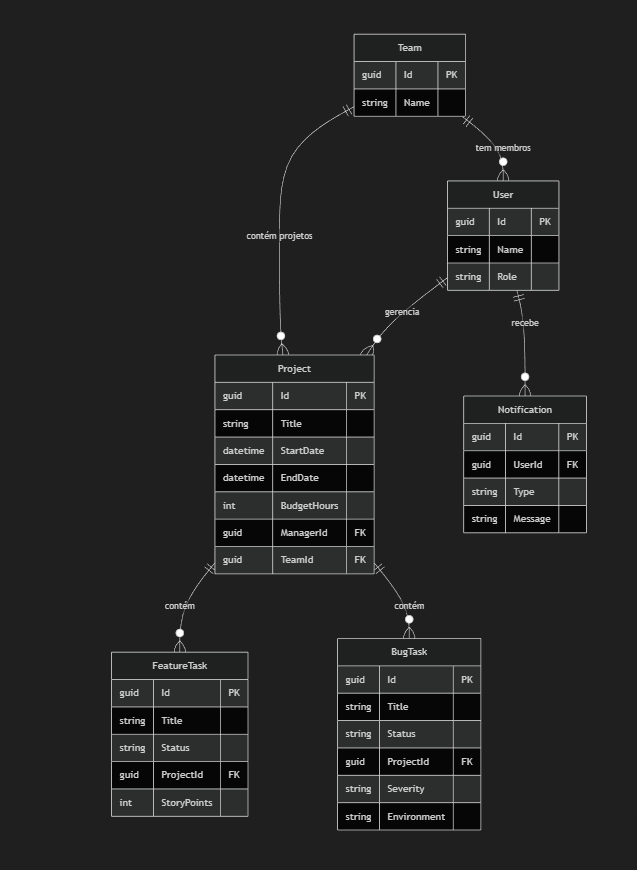

# Project Documentation

## Real-Time Collaborative System for Team and Task Management

*Technical Architecture and Implementation Report*

---

## Abstract

This document details the architecture and implementation of a real-time collaborative system for team and task management. Developed within the curricular unit of **Emerging Paradigms for Web and Mobile Development (PEDWM)**, the solution integrates a Flutter frontend application with a C# .NET backend. The architecture is based on the **Clean Architecture** paradigm, ensuring a rigorous separation of responsibilities. Communication is handled through **GraphQL** for transactional operations and complex metrics, and **WebSockets** for real-time reactivity. The adoption of advanced design patterns such as CQRS, Builder (with CRTP), Factory, and Strategy reflects full alignment with the stipulated evaluation objectives.

---

## Authors

| Name | Student ID |
|------|------------|
| Dany Raimundo | 8250047 |
| João Mendes | 8250051 |
| Magson Chostak | 8250657 |

**Institution:** School of Technology and Management (ESTG), Polytechnic Institute of Porto (IPP), Felgueiras, Portugal

---

## Technology Stack

The technology selection was guided by the need to support a clean, scalable architecture and motivated by academic interest. The following table details the technologies adopted in each layer of the system and their architectural justification.

| Layer / Domain | Technology | Purpose and Justification |
|----------------|------------|---------------------------|
| **Frontend (Mobile/Web)** | Flutter & Dart | Creation of a fluid multiplatform interface. |
| **Backend (Core)** | C# .NET | Robust framework for implementing Clean Architecture, CQRS, and object-oriented design patterns. |
| **Data Persistence** | SQL & Entity Framework Core | Object-relational mapping (ORM) to support domain entity persistence and polymorphic task inheritance. |
| **API & Data** | GraphQL (HotChocolate) | Replacement of the classic REST paradigm to allow flexible and polymorphic queries for metrics and tasks. |
| **Real-Time** | WebSockets (SignalR) | Establishment of bidirectional channels for presence alerts and instant dashboard updates. |
| **Object Mapping** | Mapster | Efficient and automatic transcription between DTOs and Domain Entities. |
| **API Testing** | Postman / Insomnia | Independent validation and demonstration of backend queries and mutations. |
| **Version Control** | GitHub | Source code management, lecturer integration in the repository, and Story Points traceability. |

---

## System Architecture: Clean Architecture

The project is structured in four independent layers, promoting encapsulation, testability, and system scalability:

### Domain Layer (Core)

The heart of the system. Contains pure business rules and main entities (such as Users, Projects, and Tasks). This is where structural mechanisms are centralised to ensure data always assumes a valid and safe state during instantiation, using typed Builders with CRTP to ensure code reuse and strict compliance with the DRY principle.

### Application Layer

Responsible for orchestrating use cases through the CQRS pattern. Defines Commands and Handlers, polymorphic Factories, and the notification strategy contract. Also defines repository interfaces.

### Infrastructure Layer

Handles physical and infrastructure details. Uses **Entity Framework Core** as ORM for fluent translation of domain entities to the relational database. Contains concrete repositories (`ProjectRepository`, `TaskRepository`) and delivery services for notifications (e.g. WebSockets).

### Presentation Layer

Exposes the GraphQL API. Handles request reception by transcribing Input DTOs into Commands (via Mapster), and exposes WebSocket subscriptions for the Flutter client.

---

## Project Objectives

The central objective of this project consists of the design and development of a collaborative system, operating in real time, dedicated to the integrated management of projects, task tracking, and detailed reporting of working hours.

The solution was designed to address operational and team synchronisation needs, focusing on the following functional areas:

### Project and Task Management

Enable the creation, organisation, and monitoring of the status of multiple projects and their respective tasks, ensuring a clear view of which activities each team member is assigned to.

### Time Reporting (Timesheets)

Facilitate rigorous recording of time invested by users in different tasks and project categories, allowing cross-referencing of reported hours with the stipulated time budget.

### Real-Time Presence and Collaboration

Provide an interactive environment where it is possible to identify, instantly, the context of each team member. The system allows distinguishing in real time whether a user is actively reporting hours on a specific task or is merely viewing project details at that moment.

### Effort and Assignment Monitoring

Offer the team and managers a global view of work distribution, making it possible to know exactly where (in which tasks) hours are being spent, who reported them, and what the progress rate of assigned activities is.

---

## Domain Model and Polymorphism

The system was modelled around two main inheritance hierarchies, enabling efficient polymorphic treatment for both time allocation and operational management.

### Entity Model

The data model represents business requirements and ensures relational integrity. The architecture is based on the following entities and relationships:

- **Organisational Structure (User and Team):** Users have specific roles and are grouped in teams.
- **Management Core (Project):** Acts as the aggregator of work. Each project has a time budget (`BudgetHours`), temporal periods (`StartDate`, `EndDate`), is managed by a responsible (`Manager`) and is assigned to a team.
- **Task Polymorphism (FeatureTask and BugTask):** The model reflects the distinct nature of engineering activities. Tasks are associated with projects but split into: new features (`FeatureTask`, estimated via Story Points) and anomaly fixes (`BugTask`, requiring severity and affected environment).
- **Alert System (Notification):** Entity for persistent recording of events and messages directed at users, serving as history for real-time or email notifications.

### Project Management Hierarchy (`ProjectBase`)

The abstract class `ProjectBase` unifies all entities that require temporal allocation and team effort.

| Class | Relevant Properties | Domain Responsibility |
|-------|---------------------|------------------------|
| **ProjectBase** (Abstract) | `Id`, `Title`, `StartDate`, `EndDate` | Abstract base sharing mandatory temporal properties. |
| **Project** | `BudgetHours`, `ManagerId`, `TeamId` | Represents billable or core development work managed by a project manager. |
| **Holiday** | `Type` (Fixed/Optional) | Entity for reporting official absence days. |
| **Training** | `CourseName`, `Hours` | Entity for tracking professional development. |

### Task Management Hierarchy (`TaskBase`)

Operational tasks inherit from `TaskBase`, enabling consolidated team performance metrics.

| Class | Relevant Properties | Domain Responsibility |
|-------|---------------------|------------------------|
| **TaskBase** (Abstract) | `Id`, `Title`, `Status`, `ProjectId` | Common base; encapsulates business methods such as `MarkAsDone()`. |
| **FeatureTask** | `StoryPoints` | Development unit whose weight is measured for velocity calculation. |
| **BugTask** | `Severity`, `Environment` | Priority correction unit associated with a specific environment. |

---

## Design Patterns

The solution implements multiple design patterns to solve complex structural problems, ensuring the system remains efficient, cohesive, and highly scalable:

### Builder Pattern with CRTP (Domain Layer)

Used to avoid complex constructors with multiple parameters and guarantee business rules during object creation. The adoption of the CRTP (*Curiously Recurring Template Pattern*) enabled sharing construction logic between different types of time and task entities, eliminating code duplication fluently.

### Factory Pattern (Application Layer)

Acts as the central engine for polymorphic decision-making. When receiving an external request, the factory evaluates the type of entity desired and invokes the corresponding Builder automatically. This frees the user interface and API from containing complex conditional logic.

### Strategy Pattern (Infrastructure/Application)

Applied to the notification delivery system. Allows the application to send notifications via real-time communication (WebSockets) or email delivery.

### Singleton Pattern (Infrastructure / Cross-Cutting)

Used for centralised management of system event logging. Guarantees the existence of a single global instance, which prevents conflicts and race conditions in access to log files, also minimising memory consumption during execution.

### CQRS (Command Query Responsibility Segregation)

Adopted to explicitly separate write and state-altering operations from data-read-only operations. This division optimises query performance for dashboards and perfectly mirrors the bidirectional nature of the GraphQL API.

---

## Core Technologies and Integration

### GraphQL (Data Operations & Mapping)

Used to expose a strictly typed API, implemented in the .NET backend with the **HotChocolate** framework. The Flutter client submits Input DTOs, which are automatically mapped to internal Commands using the **Mapster** library. The backend processes these mutations polymorphically and returns Output DTOs designed to meet the User Interface (UI) needs.

### WebSockets (Real-Time Communication)

Employed to ensure the collaborative context required in a team management system. The `WebSocketDeliveryStrategy` ensures that state changes in tasks and presence alerts are reflected on the virtual boards of all team members instantly.

---

## Project Management and Evaluation Criteria

Development followed the formal rules of the UC:

- **Version Control:** Repository at [GitHub](https://github.com/danyraimundo97-bit/pedwm_projeto), with documentation and full architecture visualisation.
- **Individual Assessment:** Tasks estimated and monitored using [GitHub Projects](https://github.com/users/danyraimundo97-bit/projects/1).
- **Architecture Modelling:** The complete UML architecture diagram is available for interactive viewing and high resolution. Open the draw.io source file in **[Docs/Diagrama de classes V2.drawio](Docs/Diagrama%20de%20classes%20V2.drawio)** via [diagrams.net](https://app.diagrams.net/) (File → Open from → URL or GitHub).

---

## Related Documentation

- **[Docs/Proposta.Tex](Docs/Proposta.Tex)** — LaTeX source of this technical report (LLNCS format) — [Edit on Overleaf](https://www.overleaf.com/4814399971zgmfnnmbxpsc#e70c0e)
- **[Docs/Diagrama de classes V2.drawio](Docs/Diagrama%20de%20classes%20V2.drawio)** — Class diagram (draw.io source). Open in [diagrams.net](https://app.diagrams.net/) for interactive editing
